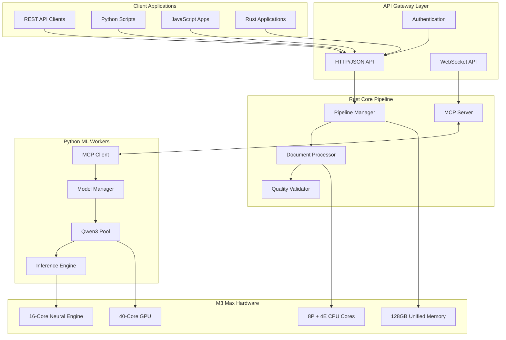

# RAN-LLM Hybrid Pipeline API Documentation

## Overview

Welcome to the comprehensive API documentation for the RAN-LLM hybrid Rust-Python document processing pipeline. This system delivers ultra-high-performance processing optimized for MacBook Pro M3 Max with 128GB unified memory, achieving 4-5x performance improvements and >0.742 quality score consistency.

## 📚 Documentation Index

### Core API Documentation
- **[OpenAPI Specification](./openapi.yaml)** - Complete REST API reference with examples
- **[MCP Protocol Guide](./mcp-protocol.md)** - Inter-process communication protocol
- **[Quickstart Guide](./quickstart-guide.md)** - Get up and running in 30 minutes
- **[Troubleshooting Guide](./troubleshooting.md)** - Diagnose and resolve common issues
- **[Performance Benchmarks](./performance-benchmarks.md)** - Optimization and monitoring

### Architecture Components
- **Rust Core Pipeline** - High-performance I/O and document processing
- **Python ML Workers** - Qwen3 model inference and quality scoring  
- **MCP Protocol Layer** - Inter-process communication and coordination
- **M3 Max Optimization** - Hardware-specific performance tuning

## 🚀 Quick Start

### Prerequisites
- MacBook Pro M3 Max with 128GB unified memory
- Rust 1.75+ with Cargo
- Python 3.11+ with uv package manager
- LM Studio or Ollama for local model serving

### 5-Minute Setup
```bash
# Clone and setup
git clone https://github.com/ricable/ran-llm-claude-flow.git
cd ran-llm-claude-flow

# Build Rust pipeline
cd src/rust-pipeline && cargo build --release --features m3-max

# Setup Python environment
cd ../python-pipeline && uv sync && source .venv/bin/activate

# Install models
ollama pull qwen3:7b

# Start pipeline
cargo run --release --bin pipeline-server
```

### First API Call
```bash
curl -X POST http://localhost:8700/api/v1/pipeline \
  -H "Content-Type: application/json" \
  -d '{
    "name": "First RAN Processing",
    "input_path": "./data/input",
    "output_path": "./data/output",
    "quality_threshold": 0.742
  }'
```

## 🔧 API Endpoints Overview

### Pipeline Management
- `POST /api/v1/pipeline` - Create and start processing pipeline
- `GET /api/v1/pipeline/{id}` - Get pipeline status and metrics
- `DELETE /api/v1/pipeline/{id}` - Stop and cleanup pipeline

### Document Processing  
- `POST /api/v1/documents/process` - Process single document
- `GET /api/v1/documents/{id}` - Get document processing result

### Model Management
- `GET /api/v1/models` - List available Qwen3 model variants
- `POST /api/v1/models/{id}/load` - Load model into memory
- `POST /api/v1/models/{id}/unload` - Unload model from memory

### System Monitoring
- `GET /api/v1/metrics` - Get comprehensive system metrics
- `GET /api/v1/health` - System health check

## 📊 Performance Targets

| Metric | Target | Description |
|--------|--------|-------------|
| **Document Throughput** | 20-30 docs/hour | End-to-end processing rate |
| **Memory Efficiency** | 85-95% utilization | Peak memory usage optimization |
| **Model Switching** | <5 seconds | Qwen3 model load/unload time |
| **Quality Consistency** | 0.742 ± 0.05 | Quality score variance target |
| **Error Rate** | <2% | Failed document processing rate |

## 🏗️ Architecture Diagram



## 🔐 Authentication

### API Key Authentication
```bash
curl -H "X-API-Key: your-api-key-here" \
     http://localhost:8700/api/v1/metrics
```

### Bearer Token Authentication
```bash
curl -H "Authorization: Bearer your-jwt-token" \
     http://localhost:8700/api/v1/pipeline
```

## 📈 Response Format

All API responses follow this standardized format:

### Success Response
```json
{
  "success": true,
  "data": {
    "pipeline_id": "pl_7d4c9b2a1e8f",
    "status": "running",
    "progress": 45.2
  },
  "metadata": {
    "timestamp": "2024-08-23T10:30:00Z",
    "version": "1.0.0",
    "request_id": "req_abc123"
  }
}
```

### Error Response
```json
{
  "success": false,
  "error": {
    "code": "PE003",
    "message": "Insufficient memory for model loading",
    "details": {
      "required_gb": 40.0,
      "available_gb": 12.5
    }
  },
  "metadata": {
    "timestamp": "2024-08-23T10:30:00Z",
    "trace_id": "tr_def456"
  }
}
```

## 🎯 Quality Control

### Quality Score Calculation
The system uses a multi-dimensional quality scoring algorithm:

```python
quality_score = (
    completeness_score * 0.3 +
    accuracy_score * 0.4 +
    consistency_score * 0.2 +
    technical_depth_score * 0.1
)

# Target: quality_score >= 0.742
```

### Quality Gates
Each processing stage has configurable quality thresholds:
- **Stage 2 (Conversion)**: 0.4 minimum
- **Stage 3 (Preprocessing)**: 0.5 minimum  
- **Stage 4 (LangExtract)**: 0.6 minimum
- **Stage 5 (Conversation)**: 0.7 minimum

## 🛠️ Development Tools

### API Testing with curl
```bash
# Health check
curl http://localhost:8700/api/v1/health

# Create pipeline
curl -X POST http://localhost:8700/api/v1/pipeline \
  -H "Content-Type: application/json" \
  -d @pipeline-config.json

# Monitor progress
watch -n 5 "curl -s http://localhost:8700/api/v1/pipeline/pl_123 | jq '.progress'"
```

### Python SDK Example
```python
from ran_llm_client import RanLlmClient

client = RanLlmClient("http://localhost:8700")

# Create and monitor pipeline
pipeline = await client.create_pipeline({
    "input_path": "./documents",
    "quality_threshold": 0.742
})

async for status in pipeline.monitor():
    print(f"Progress: {status.progress:.1f}%")
    if status.completed:
        break
```

### JavaScript SDK Example  
```javascript
import { RanLlmClient } from '@ran-llm/client';

const client = new RanLlmClient('http://localhost:8700');

const pipeline = await client.createPipeline({
  inputPath: './documents',
  qualityThreshold: 0.742
});

pipeline.on('progress', (status) => {
  console.log(`Progress: ${status.progress}%`);
});
```

## 🔍 Monitoring and Observability

### Real-time Metrics
```bash
# System metrics
curl http://localhost:8700/api/v1/metrics

# Pipeline-specific metrics
curl http://localhost:8700/api/v1/pipeline/pl_123/metrics

# Model performance
curl http://localhost:8700/api/v1/models/qwen3_7b/metrics
```

### WebSocket Monitoring
```javascript
const ws = new WebSocket('ws://localhost:8700/ws/metrics');

ws.onmessage = (event) => {
  const metrics = JSON.parse(event.data);
  console.log(`Throughput: ${metrics.pipeline.documents_per_hour}/hour`);
};
```

### Performance Dashboard
Access the real-time performance dashboard at:
`http://localhost:8700/dashboard`

## 📋 Configuration Examples

### Development Configuration
```yaml
pipeline:
  mode: "development"
  batch_size: 10
  enable_debug: true
  
models:
  default_model: "qwen3_1_7b"
  enable_model_switching: false
  
monitoring:
  enable_detailed_logging: true
  log_level: "debug"
```

### Production Configuration  
```yaml
pipeline:
  mode: "production"
  batch_size: 100
  retry_attempts: 3
  
models:
  model_strategy: "adaptive" 
  enable_circuit_breaker: true
  
monitoring:
  enable_metrics: true
  enable_alerting: true
  log_level: "info"
```

### High-Performance Configuration
```yaml
hardware:
  enable_apple_silicon_acceleration: true
  enable_metal_performance_shaders: true
  enable_neural_engine: true
  
memory:
  pools:
    models: 50GB
    processing: 60GB  
    cache: 18GB
    
pipeline:
  max_parallel_stages: 8
  batch_size: 200
```

## 🚨 Error Handling

### Common Error Codes
- **400**: Bad Request - Invalid parameters
- **404**: Not Found - Pipeline/document not found
- **429**: Too Many Requests - Rate limited
- **500**: Internal Server Error - Pipeline failure
- **503**: Service Unavailable - Models not loaded

### Error Recovery Strategies
```python
import asyncio
from ran_llm_client import RanLlmClient, RanLlmError

async def robust_processing():
    client = RanLlmClient("http://localhost:8700")
    
    for attempt in range(3):  # Retry up to 3 times
        try:
            pipeline = await client.create_pipeline(config)
            return await pipeline.wait_for_completion()
        except RanLlmError as e:
            if e.code == "PE003":  # Memory error
                # Reduce batch size and retry
                config["batch_size"] //= 2
                await asyncio.sleep(30)  # Wait for memory cleanup
            elif attempt == 2:  # Final attempt
                raise
            else:
                await asyncio.sleep(10)  # Brief wait before retry
```

## 📖 Additional Resources

### Code Examples
- **Python Client Examples**: [/examples/python/](../examples/python/)
- **JavaScript Examples**: [/examples/javascript/](../examples/javascript/)  
- **Rust Integration**: [/examples/rust/](../examples/rust/)
- **Configuration Templates**: [/examples/configs/](../examples/configs/)

### Integration Guides
- **CI/CD Integration**: [/docs/integration/cicd.md](../integration/cicd.md)
- **Docker Deployment**: [/docs/deployment/docker.md](../deployment/docker.md)
- **Kubernetes Setup**: [/docs/deployment/kubernetes.md](../deployment/kubernetes.md)
- **Monitoring Setup**: [/docs/monitoring/setup.md](../monitoring/setup.md)

### Performance Guides  
- **M3 Max Optimization**: [/docs/optimization/m3-max.md](../optimization/m3-max.md)
- **Memory Management**: [/docs/optimization/memory.md](../optimization/memory.md)
- **Model Selection**: [/docs/optimization/models.md](../optimization/models.md)
- **Scaling Strategies**: [/docs/scaling/distributed.md](../scaling/distributed.md)

## 🤝 Support and Contributing

### Getting Help
- **GitHub Issues**: [Report bugs and request features](https://github.com/ricable/ran-llm-claude-flow/issues)
- **Documentation**: [Full documentation wiki](https://github.com/ricable/ran-llm-claude-flow/wiki)
- **Discussions**: [Community discussions](https://github.com/ricable/ran-llm-claude-flow/discussions)

### Contributing
- **Code Contributions**: Follow our [contributing guidelines](../../CONTRIBUTING.md)
- **Documentation**: Help improve these docs via pull requests
- **Testing**: Run the test suite with `cargo test --all-features`
- **Benchmarks**: Contribute performance benchmarks and optimizations

## 📊 Version Compatibility

| API Version | Pipeline Version | Supported Models | Status |
|-------------|------------------|------------------|---------|
| **1.0.0** | 1.0.0 | qwen3:1.7b, qwen3:7b, qwen3:30b | ✅ Current |
| 0.9.0 | 0.9.x | qwen3:7b, qwen3:30b | ⚠️ Deprecated |
| 0.8.0 | 0.8.x | qwen3:7b | ❌ Unsupported |

---

**Ready to build with the RAN-LLM hybrid pipeline?** 

Start with our [Quickstart Guide](./quickstart-guide.md) to get up and running in minutes, then explore the [OpenAPI Specification](./openapi.yaml) for detailed API reference.