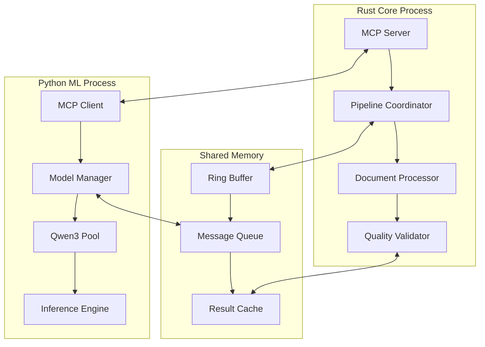

# MCP Protocol API Documentation

## Overview

The Model Context Protocol (MCP) implementation enables seamless communication between the Rust core pipeline and Python ML workers in the hybrid RAN-LLM processing system. This protocol provides high-performance inter-process communication optimized for M3 Max hardware.

## Protocol Architecture



## Core Components

### MCP Server (Rust)
- **Location**: `src/rust-pipeline/src/mcp/server.rs`
- **Purpose**: Central coordination hub for pipeline management
- **Port**: 8700 (default)
- **Protocol**: WebSocket with JSON messaging

### MCP Client (Python)
- **Location**: `src/python-pipeline/mcp/client.py`
- **Purpose**: ML worker communication interface
- **Features**: Automatic reconnection, circuit breaker patterns
- **Protocol**: WebSocket client with message acknowledgment

### MCP Host (Python)
- **Location**: `src/python-pipeline/mcp/host.py`
- **Purpose**: Pipeline orchestration and task distribution
- **Strategies**: Sequential, parallel, adaptive, resource-aware

## Message Protocol

### Message Format

All MCP messages follow this standardized JSON format:

```json
{
  "id": "msg_1234567890abcdef",
  "type": "request|response|notification|error",
  "method": "pipeline.create",
  "timestamp": "2024-08-23T10:30:00.000Z",
  "version": "1.0.0",
  "params": {},
  "result": {},
  "error": {
    "code": -1,
    "message": "Error description",
    "data": {}
  },
  "metadata": {
    "trace_id": "trace_abc123",
    "parent_id": "msg_parent123",
    "priority": "normal|high|critical"
  }
}
```

### Message Types

#### 1. Request Messages
Used for initiating operations requiring responses:

```json
{
  "id": "req_001",
  "type": "request", 
  "method": "model.load",
  "params": {
    "model_id": "qwen3_7b",
    "memory_strategy": "adaptive"
  }
}
```

#### 2. Response Messages
Acknowledge and provide results for requests:

```json
{
  "id": "req_001",
  "type": "response",
  "result": {
    "model_id": "qwen3_7b",
    "status": "loaded",
    "memory_usage_gb": 24.8,
    "load_time_ms": 1250
  }
}
```

#### 3. Notification Messages
One-way messages for status updates and events:

```json
{
  "type": "notification",
  "method": "pipeline.progress",
  "params": {
    "pipeline_id": "pl_abc123",
    "progress": 45.2,
    "stage": "langextract",
    "documents_processed": 1130
  }
}
```

#### 4. Error Messages
Communicate failures and exceptions:

```json
{
  "id": "req_001",
  "type": "error",
  "error": {
    "code": -32001,
    "message": "Model loading failed",
    "data": {
      "model_id": "qwen3_30b",
      "reason": "Insufficient memory",
      "available_gb": 12.5,
      "required_gb": 40.0
    }
  }
}
```

## Core Methods

### Pipeline Management

#### `pipeline.create`
Creates a new document processing pipeline.

**Request:**
```json
{
  "method": "pipeline.create",
  "params": {
    "name": "Ericsson RAN Processing",
    "input_path": "./data/documents",
    "output_path": "./output/processed", 
    "config": {
      "quality_threshold": 0.742,
      "batch_size": 100,
      "model_strategy": "adaptive",
      "stages": ["conversion", "preprocessing", "langextract", "conversation", "finalization"]
    }
  }
}
```

**Response:**
```json
{
  "result": {
    "pipeline_id": "pl_7d4c9b2a1e8f",
    "status": "created",
    "estimated_duration": 3600,
    "estimated_throughput": 25.0
  }
}
```

#### `pipeline.start`
Begins execution of a created pipeline.

**Request:**
```json
{
  "method": "pipeline.start",
  "params": {
    "pipeline_id": "pl_7d4c9b2a1e8f"
  }
}
```

#### `pipeline.status`
Retrieves current pipeline status and metrics.

**Response:**
```json
{
  "result": {
    "pipeline_id": "pl_7d4c9b2a1e8f",
    "status": "running",
    "progress": 45.2,
    "current_stage": "langextract",
    "documents_processed": 1130,
    "documents_total": 2500,
    "quality_score_avg": 0.748,
    "throughput_current": 28.5,
    "memory_usage_gb": 89.2,
    "estimated_completion": "2024-08-23T12:45:00Z"
  }
}
```

### Model Management

#### `model.list`
Lists available Qwen3 model variants.

**Response:**
```json
{
  "result": {
    "models": [
      {
        "model_id": "qwen3_1_7b",
        "name": "Qwen3 1.7B",
        "status": "loaded",
        "memory_usage_gb": 8.2,
        "target_throughput": 2000,
        "use_cases": ["embedding", "simple_extraction"]
      }
    ]
  }
}
```

#### `model.load`
Loads a model into memory with M3 Max optimization.

**Request:**
```json
{
  "method": "model.load",
  "params": {
    "model_id": "qwen3_7b",
    "memory_strategy": "adaptive",
    "priority": "normal"
  }
}
```

#### `model.inference`
Performs inference with a loaded model.

**Request:**
```json
{
  "method": "model.inference",
  "params": {
    "model_id": "qwen3_7b",
    "input": {
      "text": "Extract features from this RAN document...",
      "categories": ["features", "parameters", "procedures"],
      "max_tokens": 4096
    },
    "config": {
      "temperature": 0.1,
      "top_p": 0.9,
      "quality_threshold": 0.7
    }
  }
}
```

**Response:**
```json
{
  "result": {
    "extractions": [
      {
        "category": "features",
        "content": "Carrier Aggregation feature allows...",
        "confidence": 0.85,
        "source_location": "section_2.1"
      }
    ],
    "quality_score": 0.78,
    "processing_time_ms": 480,
    "tokens_used": 1250
  }
}
```

### Document Processing

#### `document.process`
Processes a single document through the pipeline.

**Request:**
```json
{
  "method": "document.process",
  "params": {
    "document_id": "doc_123",
    "document_path": "./docs/ran_spec.pdf",
    "config": {
      "quality_threshold": 0.742,
      "extract_categories": ["features", "parameters", "procedures"],
      "generate_conversations": true,
      "model_preference": "qwen3_7b"
    }
  }
}
```

### System Monitoring

#### `system.metrics`
Retrieves comprehensive system performance metrics.

**Response:**
```json
{
  "result": {
    "timestamp": "2024-08-23T10:30:00Z",
    "system": {
      "cpu_utilization": 72.5,
      "memory_total_gb": 128,
      "memory_used_gb": 89.2,
      "gpu_utilization": 45.2,
      "neural_engine_utilization": 68.7
    },
    "pipeline": {
      "documents_per_hour": 28.5,
      "avg_processing_time_ms": 1850,
      "quality_score_avg": 0.748,
      "error_rate": 0.015
    }
  }
}
```

## Error Codes

### Standard Error Codes

| Code | Name | Description |
|------|------|-------------|
| -32700 | Parse Error | Invalid JSON was received |
| -32600 | Invalid Request | The JSON sent is not a valid Request object |
| -32601 | Method Not Found | The method does not exist |
| -32602 | Invalid Params | Invalid method parameters |
| -32603 | Internal Error | Internal JSON-RPC error |

### Application-Specific Errors

| Code | Name | Description |
|------|------|-------------|
| -32001 | Model Error | Model loading/inference failed |
| -32002 | Pipeline Error | Pipeline creation/execution failed |
| -32003 | Memory Error | Insufficient memory for operation |
| -32004 | Quality Error | Quality threshold not met |
| -32005 | Timeout Error | Operation exceeded timeout |

### Error Examples

#### Model Loading Error
```json
{
  "error": {
    "code": -32001,
    "message": "Model loading failed",
    "data": {
      "model_id": "qwen3_30b",
      "reason": "Insufficient memory",
      "available_gb": 12.5,
      "required_gb": 40.0,
      "suggestions": [
        "Unload other models to free memory",
        "Use smaller model variant (qwen3_7b)",
        "Increase virtual memory allocation"
      ]
    }
  }
}
```

## Connection Management

### WebSocket Connection

```python
import websockets
import json
import asyncio

async def connect_to_mcp_server():
    uri = "ws://localhost:8700/mcp"
    
    async with websockets.connect(uri) as websocket:
        # Send handshake
        handshake = {
            "type": "request",
            "method": "system.handshake", 
            "params": {
                "client_id": "python_ml_worker_001",
                "client_type": "ml_worker",
                "protocol_version": "1.0.0",
                "capabilities": ["model_inference", "quality_scoring"]
            }
        }
        
        await websocket.send(json.dumps(handshake))
        response = await websocket.recv()
        
        print(f"Connected: {response}")
```

### Automatic Reconnection

```python
class MCPClient:
    def __init__(self, server_url: str):
        self.server_url = server_url
        self.websocket = None
        self.reconnect_delay = 1.0
        self.max_reconnect_delay = 30.0
        
    async def connect_with_retry(self):
        while True:
            try:
                self.websocket = await websockets.connect(self.server_url)
                self.reconnect_delay = 1.0  # Reset delay on successful connection
                await self.send_handshake()
                return
            except Exception as e:
                print(f"Connection failed: {e}")
                await asyncio.sleep(self.reconnect_delay)
                self.reconnect_delay = min(self.reconnect_delay * 2, self.max_reconnect_delay)
```

## Performance Optimization

### Message Batching

For high-throughput scenarios, batch multiple requests:

```json
{
  "type": "batch_request",
  "requests": [
    {
      "id": "req_001",
      "method": "model.inference",
      "params": {"text": "Document 1 content..."}
    },
    {
      "id": "req_002", 
      "method": "model.inference",
      "params": {"text": "Document 2 content..."}
    }
  ]
}
```

### Message Compression

Enable gzip compression for large payloads:

```python
import gzip
import json

def compress_message(message):
    json_str = json.dumps(message)
    return gzip.compress(json_str.encode('utf-8'))

def decompress_message(compressed_data):
    json_str = gzip.decompress(compressed_data).decode('utf-8')
    return json.loads(json_str)
```

## Circuit Breaker Pattern

Protect against cascade failures:

```python
class CircuitBreaker:
    def __init__(self, failure_threshold=5, timeout_seconds=60):
        self.failure_threshold = failure_threshold
        self.timeout_seconds = timeout_seconds
        self.failure_count = 0
        self.state = "CLOSED"  # CLOSED, OPEN, HALF_OPEN
        self.last_failure_time = None
    
    async def call(self, method, params):
        if self.state == "OPEN":
            if time.time() - self.last_failure_time > self.timeout_seconds:
                self.state = "HALF_OPEN"
            else:
                raise CircuitBreakerOpen("Circuit breaker is OPEN")
        
        try:
            result = await self.make_request(method, params)
            if self.state == "HALF_OPEN":
                self.state = "CLOSED"
                self.failure_count = 0
            return result
        except Exception as e:
            self.failure_count += 1
            if self.failure_count >= self.failure_threshold:
                self.state = "OPEN"
                self.last_failure_time = time.time()
            raise e
```

## Security Considerations

### Authentication

```json
{
  "type": "request",
  "method": "system.authenticate",
  "params": {
    "client_id": "python_ml_worker_001",
    "api_key": "sk_live_abcd1234...",
    "timestamp": "2024-08-23T10:30:00Z",
    "signature": "sha256_signature_here"
  }
}
```

### Message Validation

```python
import jsonschema

message_schema = {
  "type": "object",
  "required": ["type", "method"],
  "properties": {
    "type": {"enum": ["request", "response", "notification", "error"]},
    "method": {"type": "string"},
    "params": {"type": "object"},
    "id": {"type": "string"}
  }
}

def validate_message(message):
    try:
        jsonschema.validate(message, message_schema)
        return True
    except jsonschema.ValidationError as e:
        print(f"Invalid message: {e}")
        return False
```

## Testing

### Unit Tests

```python
import pytest
import asyncio
from unittest.mock import AsyncMock

@pytest.mark.asyncio
async def test_model_inference():
    client = MCPClient("ws://localhost:8700/mcp")
    client.websocket = AsyncMock()
    
    # Mock response
    response = {
        "type": "response",
        "result": {
            "extractions": [{"category": "features", "confidence": 0.85}],
            "quality_score": 0.78
        }
    }
    client.websocket.recv = AsyncMock(return_value=json.dumps(response))
    
    result = await client.model_inference("qwen3_7b", "test document")
    
    assert result["quality_score"] == 0.78
    assert len(result["extractions"]) == 1
```

### Integration Tests

```python
@pytest.mark.integration
async def test_full_pipeline():
    # Start MCP server
    server = MCPServer(port=8701)
    await server.start()
    
    # Connect client
    client = MCPClient("ws://localhost:8701/mcp")
    await client.connect()
    
    # Create pipeline
    pipeline_result = await client.create_pipeline({
        "name": "Test Pipeline",
        "input_path": "./test/data",
        "quality_threshold": 0.742
    })
    
    pipeline_id = pipeline_result["pipeline_id"]
    
    # Start pipeline
    await client.start_pipeline(pipeline_id)
    
    # Wait for completion
    while True:
        status = await client.get_pipeline_status(pipeline_id)
        if status["status"] in ["completed", "failed"]:
            break
        await asyncio.sleep(1)
    
    assert status["status"] == "completed"
    assert status["quality_score_avg"] >= 0.742
    
    await server.stop()
```

## Monitoring and Debugging

### Message Tracing

Enable detailed logging for debugging:

```python
import logging

logging.basicConfig(level=logging.DEBUG)
logger = logging.getLogger("mcp_client")

class MCPClient:
    async def send_message(self, message):
        trace_id = message.get("metadata", {}).get("trace_id", "unknown")
        logger.debug(f"Sending message [trace_id={trace_id}]: {json.dumps(message)}")
        
        await self.websocket.send(json.dumps(message))
        
        response_str = await self.websocket.recv()
        response = json.loads(response_str)
        
        logger.debug(f"Received response [trace_id={trace_id}]: {json.dumps(response)}")
        
        return response
```

### Performance Metrics

Track MCP protocol performance:

```python
class MCPMetrics:
    def __init__(self):
        self.request_count = 0
        self.response_times = []
        self.error_count = 0
    
    async def timed_request(self, client, method, params):
        start_time = time.time()
        
        try:
            result = await client.request(method, params)
            response_time = (time.time() - start_time) * 1000  # ms
            self.response_times.append(response_time)
            self.request_count += 1
            return result
        except Exception as e:
            self.error_count += 1
            raise e
    
    def get_stats(self):
        return {
            "request_count": self.request_count,
            "error_count": self.error_count,
            "error_rate": self.error_count / max(self.request_count, 1),
            "avg_response_time_ms": sum(self.response_times) / len(self.response_times),
            "p95_response_time_ms": sorted(self.response_times)[int(0.95 * len(self.response_times))]
        }
```

This MCP protocol documentation provides the foundation for implementing robust communication between the Rust core and Python ML workers in the hybrid RAN-LLM pipeline system.